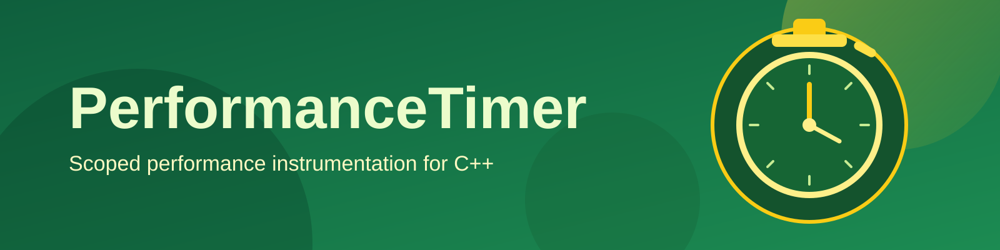

# PerformanceTimer

A header-only C++ utility for lightweight scoped performance measurements.

`PerformanceTimer` provides simple macros to instrument code blocks, aggregate elapsed time, and query timing statistics by key or alias.

## Purpose

The library is built around a singleton timer (`util::performance_timer`) and a small macro layer for low-friction instrumentation:

- `RESET_PERF`
- `START_PERF`
- `START_NAMED_PERF(name)`
- `END_PERF`

When `DO_PERFORMANCE_` is defined, macros record timing data.
When it is not defined, the macros compile to no-ops.

## Repository Layout

- `include/` public header (`performance_timer.h`)
- `test/` GoogleTest-based unit tests
- `cmake-common/` shared CMake settings (git submodule)
- `.github/workflows/` CI workflow (build, coverage, SonarQube)

## Build And Installation

Build and install were tested on Ubuntu 24.04.

### Dependencies

Required:

- CMake `>= 3.26`
- C++23 compiler (`g++` or `clang++`)

For tests:

- GoogleTest is fetched automatically by CMake (`PERFORMANCETIMER_FETCH_GOOGLETEST=ON` by default)

If you want to use a system-installed GTest instead:

- configure with `-DPERFORMANCETIMER_FETCH_GOOGLETEST=OFF`

### Clone

```bash
git clone https://github.com/kingkybel/PerformanceTimer.git
cd PerformanceTimer

git submodule update --init --recursive
```

### Build

```bash
cmake -S . -B build -DCMAKE_BUILD_TYPE=RelWithDebInfo
cmake --build build --parallel $(nproc)
```

### Install

```bash
# Change to your preferred install path
INSTALL_PREFIX=/usr/local

cmake -S . -B build \
  -DCMAKE_BUILD_TYPE=RelWithDebInfo \
  -DCMAKE_INSTALL_PREFIX=${INSTALL_PREFIX}
cmake --build build --parallel $(nproc)
sudo cmake --install build
```

Headers are installed to:

- `${INSTALL_PREFIX}/include/dkyb`

Example include after install:

```c++
#include <dkyb/performance_timer.h>
```

## Usage

### Basic Instrumentation

```c++
#define DO_PERFORMANCE_
#include <dkyb/performance_timer.h>

void work()
{
    RESET_PERF;

    START_PERF;
    // code to measure
    END_PERF;

    auto& timer = util::performance_timer::instance();
    auto stats = timer.get_stats();
}
```

### Named Sections

```c++
#define DO_PERFORMANCE_
#include <dkyb/performance_timer.h>

void run_loop()
{
    START_NAMED_PERF(outer_loop);
    // code to measure
    END_PERF;

    auto& timer = util::performance_timer::instance();
    auto stat = timer.get_stat("outer_loop");
}
```

## Testing

Run all tests:

```bash
ctest --test-dir build --output-on-failure
```

Executable output path with current CMake settings:

- `build/RelWithDebInfo/bin/run_tests`

## CI

GitHub Actions workflow runs:

- build
- test + coverage artifact generation
- SonarQube scan

Workflow file:

- `.github/workflows/cmake-single-platform.yml`

## Powered By

[](https://sonarcloud.io/project/overview?id=kingkybel)
